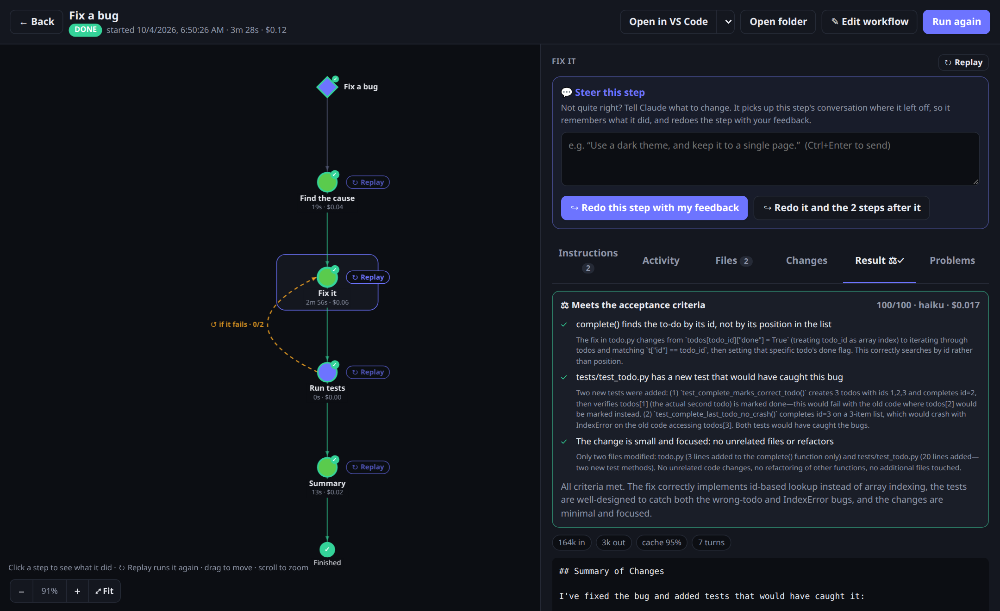
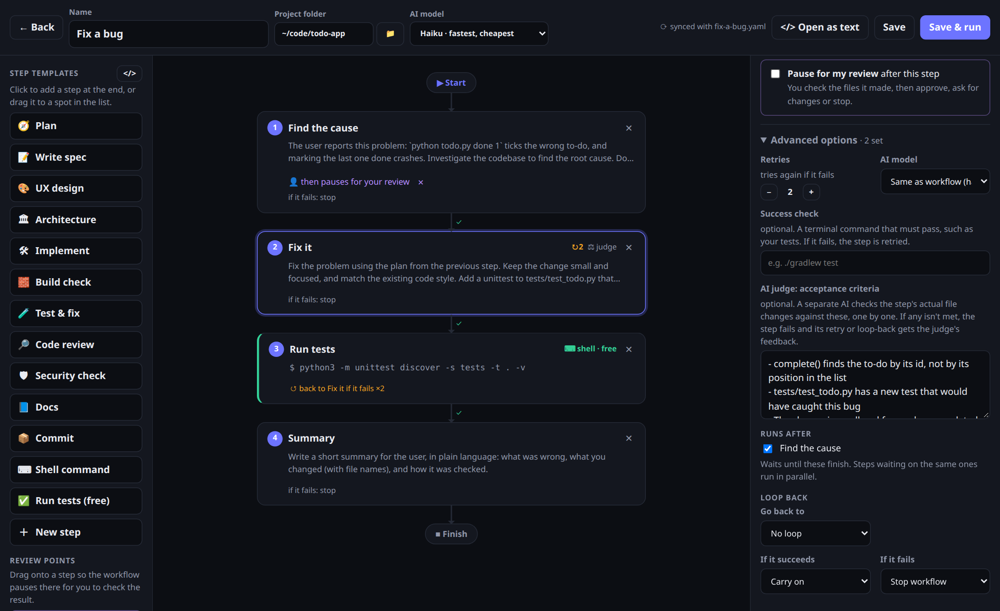
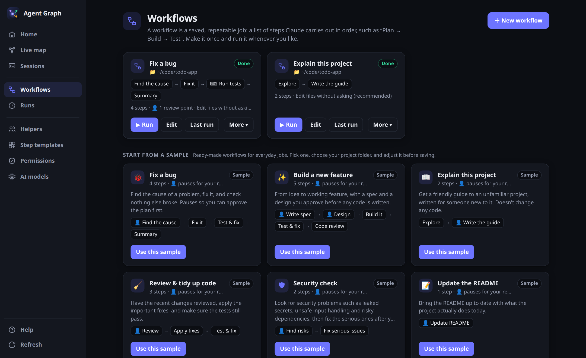
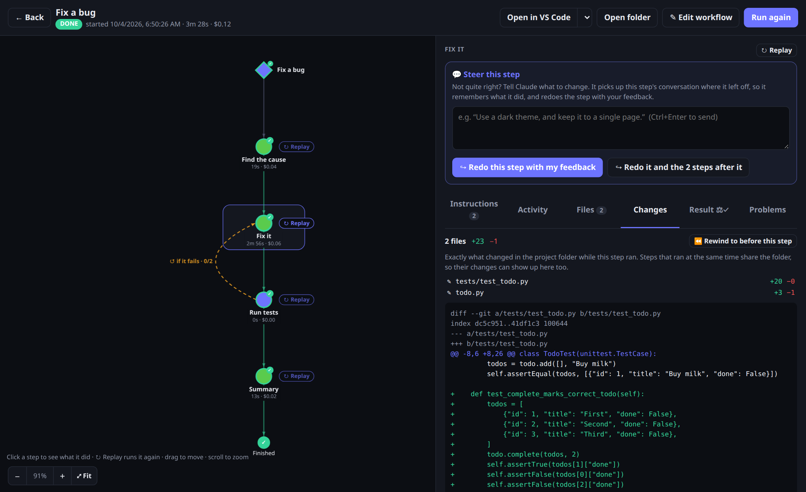
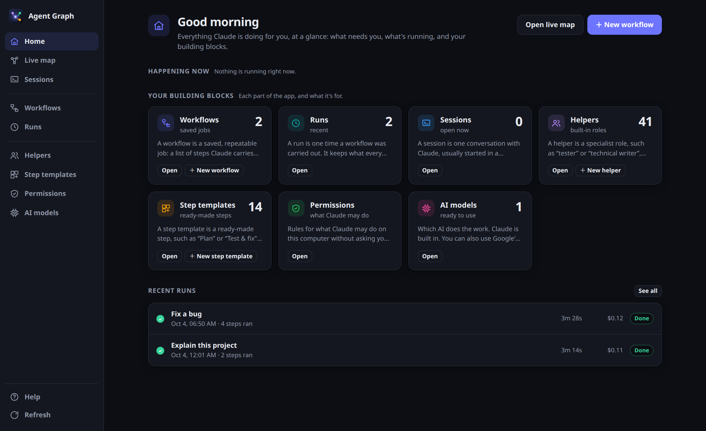
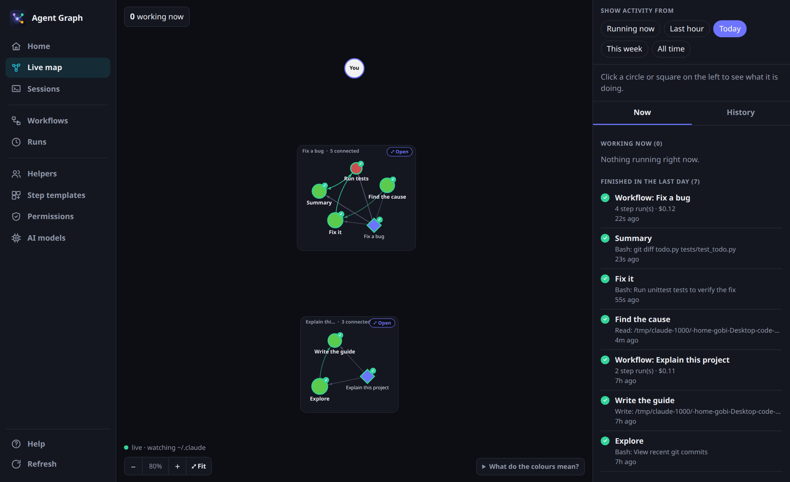

<p align="center"></p>

<h1 align="center">Claude Agent Graph</h1>

Build **workflows** for [Claude Code](https://claude.com/claude-code) and run them reliably. Chain Claude steps and shell commands, then let each step check its own work:

- **Tests:** a `check:` command must pass.
- **AI judge:** an independent model grades the step's real changes against acceptance criteria you write in plain words.
- **Retries:** a failed step is redone with the judge's feedback, so retries fix what was wrong instead of trying the same thing again.
- **Reviews:** the run pauses for you wherever you want to look first.

Every step is checkpointed, so you can see exactly what it changed and rewind it. You can run a workflow in a separate copy of your project, hand the result back as a branch or pull request, and run any workflow from the terminal or CI. You design workflows in a drag-and-drop builder or as plain YAML kept with your code.

A **live map** shows what Claude Code is doing while it works: every session, the helper agents it starts, and how they hand work to each other.

One small program for **macOS, Linux and Windows**: nothing else to install besides Claude Code.



## Screenshots

The screenshots come from a small demo project: a to-do app with a planted bug, fixed by the sample **Fix a bug** workflow running on Claude Haiku. The whole run cost $0.12.

| | |
|---|---|
|  |  |
| **Builder.** Steps, review pauses, a free shell step that loops back to “Fix it” if the tests fail, and the AI judge's acceptance criteria. | **Workflows.** Your saved workflows, plus ready-made samples to start from. |
|  |  |
| **AI judge.** Each criterion met or not, with evidence from the diff, plus token use and prompt-cache hit rate. | **Changes.** Exactly what a step changed, with one click to rewind the folder to before it. |
|  |  |
| **Home.** What needs you, what's running, recent runs and their cost. | **Live map.** Every Claude Code session, workflow and helper agent, and how they hand work to each other. |

## Features

### Workflows

- **Builder**: drag-and-drop steps that run as headless `claude -p` sessions or as free shell commands, in dependency order and in parallel where possible. Workflows are plain YAML in `<project>/.claude/workflows/`, so they're versioned with your code and editable by hand.
- **Checks and retries**: a shell `check:` must pass, a failed step retries with the reason it failed, and `loopBack` sends the run back to an earlier step (for example, "tests fail → fix it again").
- **AI judge**: write a step's acceptance criteria in plain words; an independent AI grades the step's real file changes against them, and its feedback drives the retry.
- **Review checkpoints**: a step can pause for your approval or feedback before the workflow goes on.
- **Steering**: send Claude guidance while a step runs (it continues the same conversation with your message), or redo a finished step with your feedback.
- **Step diffs and rewind**: every step is checkpointed, so you see exactly what it changed and can put the project back to before it (and undo that).
- **Run inputs, a separate copy of the project per run, and delivery as a branch or pull request**: see [Inputs, separate copies and branches](#inputs-separate-copies-and-branches).
- **Command line**: list, run and validate workflows from the terminal, by name or straight from a workflow YAML file (`agent-graph run flow.yaml`, `agent-graph validate flows/*.yaml`), handy for scripts, cron and CI.
- **Sample workflows**: ready-made workflows (fix a bug, build a feature, explain a project, security check, …) to start from.
- **Agent library**: ready-made subagent roles (product owner, architect, reviewer, tester, …) you can drop into steps.
- **Other AI models**: run a workflow, or a single step, on Google Gemini, OpenAI GPT, or a free local model through Ollama, alongside Claude.
- **Token insight**: each step's cost, input/output tokens, prompt-cache hit rate and turns.

### Live map

- **Live graph** of Claude Code sessions, workflows and subagents, built by tailing the transcripts in `~/.claude`. By default it shows what's live; the filter bar at its top-right adds **Older** activity from a time range you pick.
- **Activity feed**: prompts, helper starts and hand-backs, files written or edited.
- **Stop a running session** from the graph.

### Also

- **Permissions editor** for `~/.claude/settings.json`.

## Requirements

| | |
|---|---|
| **Claude Code** | The `claude` CLI on your `PATH`, signed in: install it from [claude.com/claude-code](https://claude.com/claude-code), then run `claude` once and log in. |
| **git** | Step diffs and rewind use it. On Windows, [Git for Windows](https://git-scm.com/download/win) also provides the bash that shell steps run in (Claude Code needs it too). |

## Install

### macOS / Linux

```sh
curl -fsSL https://raw.githubusercontent.com/gobi12b/claude-agent-graph/main/install.sh | sh
```

### Windows (PowerShell)

```powershell
irm https://raw.githubusercontent.com/gobi12b/claude-agent-graph/main/install.ps1 | iex
```

The installer downloads the right program for your computer from [`binaries/`](binaries/) and checks it against `binaries/SHA256SUMS`. Then it:

- **macOS / Linux:** puts it at `~/.local/bin/agent-graph` and, on Linux, adds an app-menu entry with the icon.
- **Windows:** puts it at `%LOCALAPPDATA%\Programs\claude-agent-graph\agent-graph.exe`, adds that folder to your `PATH`, and adds a Start-menu shortcut. Open a new terminal afterwards so the `PATH` change is picked up.

### Or download it yourself

| Computer | File | Notes |
|---|---|---|
| Linux, x86_64 | [`agent-graph-linux-x86_64-window`](binaries/agent-graph-linux-x86_64-window) | Native window. Needs WebKitGTK (`sudo apt install libwebkit2gtk-4.1-0` on Debian/Ubuntu, `sudo dnf install webkit2gtk4.1` on Fedora) and glibc 2.39+ (Ubuntu 24.04, Fedora 40 or newer). |
| Linux, x86_64 | [`agent-graph-linux-x86_64`](binaries/agent-graph-linux-x86_64) | Opens in your browser. Runs on any distro with glibc 2.28+ (2018 or newer). |
| Linux, ARM64 | [`agent-graph-linux-arm64`](binaries/agent-graph-linux-arm64) | Opens in your browser. glibc 2.28+. |
| macOS (Apple Silicon and Intel) | [`agent-graph-macos-universal`](binaries/agent-graph-macos-universal) | Opens in your browser. |
| Windows 10 / 11 (x64, and ARM through emulation) | [`agent-graph-windows-x86_64.exe`](binaries/agent-graph-windows-x86_64.exe) | Native window (Edge WebView2, preinstalled on Windows 10 and 11). |

Rename it to `agent-graph` (`agent-graph.exe` on Windows) and put it somewhere on your `PATH`. On macOS and Linux, make it executable first: `chmod +x agent-graph`. On macOS, a file downloaded in a browser is quarantined, so clear it once: `xattr -d com.apple.quarantine agent-graph`. The installer's download doesn't need this.

## Run

```sh
agent-graph              # opens a native window if this build has one, otherwise your browser
agent-graph --browser    # always use the browser (serves on http://127.0.0.1:8765)
agent-graph --port 9000  # pick the port
agent-graph --version
```

The server listens only on `127.0.0.1`, and every API call needs a random token issued at startup, so other websites can't reach it.

### Native window vs. browser

| OS | Window | Notes |
|---|---|---|
| Linux | WebKitGTK | In the `-window` build. If it can't open a window (for example over SSH), it falls back to the browser. |
| Windows | Edge WebView2 | In the Windows build. |
| macOS | WKWebView (built in) | The prebuilt file opens in the browser. For a window, [build from source](#build-from-source) on a Mac with `--features window`. |

Without a native window, the app opens in your default browser and works the same way.

## Run workflows from the terminal

Every workflow can also run from the command line: the ones you built in the app, and any workflow YAML file. The terminal shows live progress, and the run is saved like any other, so it also shows up (live) on the app's **Runs** page.

```sh
agent-graph list                                  # workflows the app knows: name, id, steps and project folder
agent-graph run "Fix a bug"                       # run one by name, the start of its name, or its id
agent-graph run ./flows/nightly.yaml              # run a workflow file
agent-graph run ./flows/nightly.yaml -C ~/code/app   # ...in another project folder
agent-graph run fix-a-bug --yes                   # approve review points automatically (scripts, CI)
agent-graph validate ./flows/*.yaml               # check workflow files without running them
agent-graph runs                                  # recent runs: id, when, status, duration, cost
agent-graph run "Fix a bug" --input bug="Login fails on Safari"   # give the workflow's inputs
agent-graph clean                                 # remove the separate copies of finished runs
```

| Option | For |
|---|---|
| `run <workflow>` | A workflow file (anything ending in `.yaml`/`.yml`, or a path), or the id, exact name or start of the name of a workflow the app knows (not case-sensitive). If several match, it lists them so you can use the id. |
| `-C`, `--folder <dir>` | Run (or validate) in this project folder instead of the workflow's `cwd`. Handy for keeping one workflow file and running it on many projects. |
| `-y`, `--yes` | Approve every review point without asking. |
| `-i`, `--input NAME=VALUE` | a value for one of the workflow's inputs. Repeat it for more. |
| `--inputs <file.json>` | input values from a JSON file (`--input` wins over it). |
| `--isolation worktree\|none` | run in a separate copy of the project, or in the folder itself, whatever the workflow says. |
| `-q`, `--quiet` | Don't print the final step's result at the end. |
| `--json` | Print a JSON summary (status, cost, each step's output) instead of progress. Also works with `list` and `runs`. |
| `runs -n 30` | How many recent runs to list (default 15). |

**Review points.** When a step pauses for review, the terminal shows that step's result and asks:

```
👤 “Find the cause” is done and waiting for your review.
Approve and continue [a], request changes [c], or stop [s]?
```

- `a` continues. You can add optional notes for the next step.
- `c` asks what should change, then redoes the step with your feedback.
- `s` stops the run.

If nobody can answer (no terminal, for example in CI) and `--yes` isn't set, the run stops at the review point and exits with code `3`.

### Workflow files

A workflow file is the same YAML the app saves in `<project>/.claude/workflows/`. You can keep it anywhere: in a repo, in a shared folder of team workflows, or next to a script. The smallest useful one:

```yaml
name: Say hello
steps:
  - name: Hello
    prompt: Write hello.txt containing a friendly greeting.
  - name: Check
    run: test -f hello.txt        # a shell step: no AI, no cost
```

Which folder it runs in:

1. `--folder` / `-C`, if given.
2. Otherwise `cwd:` in the file. A relative `cwd` (such as `cwd: ..`) is relative to the file, not to where you run the command.
3. Otherwise the project the file belongs to, if it's inside `<project>/.claude/workflows/`; else the file's own folder.

The other settings are the ones the builder writes (open any workflow with **Open as text** to see them all): `model`, `permissionMode`, `allowedTools`, `disallowedTools`, `passOutput`, `maxBudgetUsd`, `judgeModel`, `agents`, and per step `prompt` or `run` (with `timeout` in seconds for `run`), `retries`, `check`, `judge`, `model`, `review`, `agents`, `dependsOn`, `onSuccess`, `onFailure` and `loopBack`. Steps run one after another unless `dependsOn` says otherwise. Replaying a step of a file run from the app reads the file again.

### Check workflows: `validate`

`validate` loads workflows the same way `run` does, but doesn't run anything:

```sh
agent-graph validate                       # every workflow the app knows
agent-graph validate flows/*.yaml          # these files
agent-graph validate "Fix a bug" --strict  # warnings count as errors too
```

```
✓ Say hello  ~/flows/hello.yaml · 2 steps · runs in ~/flows
⚠ Nightly  ~/flows/nightly.yaml · 3 steps · runs in ~/code/app
    warning: step 1 (“Plan”): unknown setting “promt” (did you mean “prompt”?)
    warning: workflow: model “gemini” can't run on this computer yet: Gemini isn't installed. Install it with: …
✗ ~/flows/broken.yaml
    error: line 5, column 1: found unexpected end of stream
2 of 3 valid (2 warning(s))
```

- **Errors** stop a workflow from loading or running. Examples: invalid YAML (with line and column), a missing `name` or `steps`, a step with no prompt or command, a missing `cwd` folder, `dependsOn`/`loopBack` pointing at a step that doesn't exist, a dependency loop, or an undefined helper.
- **Warnings** are probably mistakes, but the workflow would still run:
  - unknown settings, with a "did you mean" guess
  - a model that isn't set up on this computer
  - an unfilled `<describe …>` or `{task}` placeholder
  - a helper no step uses

Exit code: `0` when everything is valid; `1` when anything has an error, or a warning with `--strict`. `--json` prints the full report. To check workflows in CI:

```sh
agent-graph validate .claude/workflows/*.yaml --strict
```

**Stopping.** Press `Ctrl+C` to stop a run cleanly. You can also press **Stop** on the run in the app: it asks the terminal to stop, as if you had pressed `Ctrl+C` there (macOS and Linux). Reviews and steering of a terminal run happen in that terminal. Once it has finished, you can replay or steer its steps from the app.

**Exit codes**, for scripts:

| Code | Meaning |
|---|---|
| `0` | Finished successfully |
| `1` | A step failed, the workflow wasn't found, a required input is missing, or the branch or pull request couldn't be made |
| `2` | Stopped (`Ctrl+C`, Stop in the app, or `s` at a review) |
| `3` | Paused for review, but there was no terminal to answer it (use `--yes`) |

Example: run a workflow every night with cron, and keep the log:

```sh
0 2 * * *  cd ~/code/my-app && agent-graph run "Review & tidy up code" --yes >> ~/agent-graph-nightly.log 2>&1
```

## Inputs, separate copies and branches

Three workflow settings make runs repeatable and safe to leave unattended:

```yaml
name: Fix a bug
inputs:
  bug: What's going wrong?                 # shorthand: a required text input
  severity: {type: choice, options: [low, high], default: low}
isolation: worktree                        # run in a separate git worktree
worktree: {copy: [.env], setup: npm ci, keep: onFailure}
deliver:                                   # the run's changes as a branch, one commit per step
  branch: "fix/{{ inputs.bug | slug }}"
  pr: {draft: true}                        # push it and open a pull request (needs gh)
steps:
  - name: Fix it
    prompt: "Fix this bug: {{ inputs.bug }} (severity {{ inputs.severity }})"
    check: npm test
```

- **Inputs.** **▶ Run** asks for them in a form (filled in with the last values you used). In the terminal, pass `--input bug="Login fails on Safari"` (repeat it for more inputs) or `--inputs values.json`. If a required input is missing, the terminal asks for it, or exits with code `1` when there's no one to ask. Templates can use `{{ inputs.<name> }}`, `{{ steps.<id>.output }}`, `{{ run.id }}`, `{{ run.folder }}` and `{{ run.project }}`, with the filters `default("…")`, `slug`, `trim` and `json`. In `run:` commands and `check:`s each value is quoted for the shell, and shell steps also get each input as `$INPUT_<NAME>`.
- **Separate copy (`isolation: worktree`).** The run works in its own git worktree in `~/.config/claude-agent-graph/worktrees/`, starting from `base` (default `HEAD`). Your folder and other runs aren't touched, and each step's diff is exactly its own. Uncommitted changes in your folder aren't included; list files the run needs, such as `.env`, under `copy`. `keep` says when to delete the copy: `always` keeps it, `onFailure` (the default) keeps it only when the run fails, `never` always deletes it. Its changes stay available after it's deleted. In the run view you can **Apply to my folder** (undoable; nothing is applied unless all of it applies cleanly), **Create branch**, **Open pull request** or **Discard copy**. `agent-graph run … --isolation worktree` turns it on for one run, and `agent-graph clean` removes the copies of finished runs.
- **Branches (`deliver`).** Builds commits from the step checkpoints on top of the base commit, without touching your checkout. The commits hold only the run's changes: files copied in, or made by `setup`, never get committed. `commit: squash` makes a single commit. `when: always` also delivers failed runs. `push: true` pushes the branch, and `pr` pushes it and opens a pull request whose description lists each step, its AI judge score and the cost. Replaying steps and delivering again moves the same branch and keeps its pull request. If you have no git identity set, commits are made as "Claude Agent Graph".

## AI models: Claude, Gemini, GPT and local models

Steps run on Claude by default. You can also use other models for a whole workflow (the **AI model** menu in the builder's top bar) or for one step (the step's **Advanced options**). The app's **AI models** page shows what's installed and ready. If something isn't, it shows how to set it up, with commands you can copy. Click **Check again** after installing.

| Provider | Runs through | Set up |
|---|---|---|
| **Claude** (default) | Claude Code: `claude -p` | Already required by the app. |
| **Gemini** (Google) | [Gemini CLI](https://github.com/google-gemini/gemini-cli): `gemini` | `npm install -g @google/gemini-cli`, then run `gemini` once and sign in (or set `GEMINI_API_KEY`). |
| **GPT** (OpenAI) | [Codex CLI](https://github.com/openai/codex): `codex exec` | `npm install -g @openai/codex`, then run `codex` once and sign in with ChatGPT (or set `OPENAI_API_KEY`). |
| **Local models** (Ollama) | Claude Code, pointed at [Ollama](https://ollama.com)'s Anthropic-compatible API | Install Ollama 0.14 or newer, start it (`ollama serve` or the desktop app), and download a model: `ollama pull qwen3-coder`. |

How each one works in a workflow:

- **Gemini and GPT** steps can read and edit files in the project folder. Gemini runs with `--yolo`; Codex runs with `--full-auto`, which `plan` mode makes read-only. They have no subagents, so a step's helpers are given to them as role instructions in the prompt. Steering a running step restarts it with your guidance added (Claude continues the same conversation instead). Their cost isn't reported, so it shows as $0.00.
- **Local models** keep everything Claude Code offers (tools, helpers, steering) and cost nothing. All of Claude Code's model roles map to the model you pick. Pick one that is good at coding and tool use; small models may struggle with multi-step work. To use Ollama on another machine, set `OLLAMA_HOST` (for example `OLLAMA_HOST=http://192.168.1.20:11434`).
- If a step's model isn't available when it runs (tool not installed, Ollama not running, model not downloaded), the step fails straight away with a message saying what to do.

In workflow YAML, `model:` (for the workflow or one step) is `haiku`, `sonnet`, `opus` or `fable` for Claude; `gemini` or `gemini:<model>`; `gpt` or `gpt:<model>`; or `ollama:<model>`, for example `ollama:qwen3-coder`. A plain `gemini` or `gpt` means that tool's default model. Don't write `gemini:` with nothing after the colon by hand: that isn't valid YAML unless it's quoted. Model names you add on the AI models page are offered in the menus.

## AI judge, step diffs and rewind

### AI judge

A shell `check:` can only test what a command can test. For everything else (“did it fix the root cause?”, “is every requirement in the spec covered?”), give the step acceptance criteria:

```yaml
- id: fix
  name: Fix it
  retries: 2
  prompt: Fix the bug using the plan from the previous step.
  judge: |
    - The root cause is fixed, not just the symptom
    - A test reproduces the bug and now passes
    - No unrelated files changed
```

After the step (and its `check:`, if any) succeeds, a separate model with a fresh context and no tools grades it:

- It judges each criterion on **evidence**: the git diff of everything the step changed (or, outside git, the files it wrote). The step's own summary is treated as a claim, not proof.
- The verdict is structured (pass, a 0–100 score, and met / not met with evidence for each criterion), so it can't be vague.
- If it fails, the step fails, and the judge's feedback becomes the reason given to the retry or loop-back. That makes retries an evaluate → fix loop instead of trying the same thing again.

The judge uses Haiku by default (usually a cent or two per verdict). Choose Sonnet or Opus in the workflow's **Advanced options** (`judgeModel:` in YAML). A judge that isn't the model that did the work tends to be stricter. Verdicts show on the step's **Result** tab and in the terminal (`⚖ judge 92/100`).

### Step diffs and rewind

When the workflow folder is a git repository, the project is snapshotted before and after every step. Snapshots use a private index, so your branch, staged changes, HEAD and stash are never touched; uncommitted and untracked files are included and `.gitignore` is respected.

- The step's **Changes** tab shows the files it added, edited or deleted and the full diff.
- **⏪ Rewind to before this step** puts the folder back exactly as it was when that step started (undoing it and every later change). The current state is snapshotted first, so **↶ Undo rewind** brings it all back. Rewinding is only possible while the run isn't running.
- Steps that run in parallel share the folder, so one's diff can include the other's changes.
- Snapshots are ordinary git objects that nothing references, so `git gc` removes them after a couple of weeks; old runs then show no diff.

### Token insight

Each Claude step's **Result** tab shows the tokens it read and wrote, its number of turns, and its **prompt-cache hit rate**. A low cache rate on a long step usually means the context kept changing, which costs more and runs slower.

## Platform notes

- **Shell steps** (`run:`) and **checks** (`check:`) run with `bash -lc` in the workflow folder: bash on macOS/Linux, Git Bash on Windows (found via `CLAUDE_CODE_GIT_BASH_PATH`, `git`, or the default install paths). If there's no bash on Windows, they fall back to `cmd.exe`.
- **Opening files** uses `xdg-open` on Linux, `open` on macOS and the default app association on Windows. If an IDE is installed (VS Code, Cursor, Windsurf, JetBrains IDEs, Zed or Sublime Text), its CLI is used instead.
- **Notifications** (e.g. "a step is waiting for your review") use `notify-send` on Linux, Notification Center on macOS and a tray balloon on Windows.
- **Folder picker** (when choosing a project folder) uses `zenity` or `kdialog` on Linux; otherwise you type the path.

## Where things live

| What | Where |
|---|---|
| Claude Code transcripts (read only) | `~/.claude/projects/`, `~/.claude/sessions/` |
| Your workflows | `<project>/.claude/workflows/<id>.yaml` |
| Your agent and step additions | `~/.config/claude-agent-graph/agents.yaml`, `steps.yaml` |
| Run history and logs | `~/.config/claude-agent-graph/runs/` |
| Separate copies of runs (`isolation: worktree`) | `~/.config/claude-agent-graph/worktrees/` (remove finished ones with `agent-graph clean`) |
| App settings (chosen IDE, extra model names, known projects) | `~/.config/claude-agent-graph/settings.json` |
| Built-in agent library, step templates and sample workflows | Inside the program. A copy is written to `~/.config/claude-agent-graph/builtin/` so you can open it in your editor; it's refreshed when you update. When you run from a clone, `defaults/` in the clone is used instead. Set `AGENT_GRAPH_DEFAULTS` to use another folder. |

On Windows, `~` means your user folder (`C:\Users\<you>`).

## Update / uninstall

To update, run the installer again.

To uninstall:

```sh
# macOS / Linux
rm -f ~/.local/bin/agent-graph ~/.local/share/applications/claude-agent-graph.desktop
rm -rf ~/.local/share/claude-agent-graph
```

```powershell
# Windows
Remove-Item -Recurse "$env:LOCALAPPDATA\Programs\claude-agent-graph"
Remove-Item "$([Environment]::GetFolderPath('Programs'))\Claude Agent Graph.lnk"
```

Your settings and run history stay in `~/.config/claude-agent-graph` until you delete that folder.

## Build from source

You need the [Rust toolchain](https://rustup.rs) (1.89 or newer) and a C linker:

| OS | Install Rust | Linker |
|---|---|---|
| macOS | `curl --proto '=https' --tlsv1.2 -sSf https://sh.rustup.rs \| sh` | `xcode-select --install` |
| Linux | `curl --proto '=https' --tlsv1.2 -sSf https://sh.rustup.rs \| sh` | Debian/Ubuntu: `sudo apt install build-essential`; Fedora: `sudo dnf install gcc`; Arch: `sudo pacman -S base-devel` |
| Windows | `winget install --id Rustlang.Rustup -e` | Visual Studio Build Tools, "Desktop development with C++" workload (rustup offers to install it) |

Then:

```sh
git clone https://github.com/gobi12b/claude-agent-graph
cd claude-agent-graph
cargo install --path .                    # browser build, installed to ~/.cargo/bin
cargo install --path . --features window  # with the native window
```

Or install straight from GitHub: `cargo install --git https://github.com/gobi12b/claude-agent-graph --features window`.

The native window needs these to **build**:

| OS | Install first |
|---|---|
| Linux | Debian/Ubuntu: `sudo apt install libwebkit2gtk-4.1-dev`; Fedora: `sudo dnf install webkit2gtk4.1-devel`; Arch: `sudo pacman -S webkit2gtk-4.1` |
| macOS | Nothing beyond Xcode's Command Line Tools |
| Windows | Nothing |

### Rebuilding the files in `binaries/`

Everything except the Linux window build is cross-compiled from one Linux machine with [cargo-zigbuild](https://github.com/rust-cross/cargo-zigbuild). It uses [zig](https://ziglang.org) as the linker, so no other toolchains or SDKs are needed:

```sh
cargo install cargo-zigbuild    # and install zig: https://ziglang.org/download (or your package manager)
rustup target add x86_64-unknown-linux-gnu aarch64-unknown-linux-gnu x86_64-pc-windows-gnu x86_64-apple-darwin aarch64-apple-darwin

cargo zigbuild --release --target x86_64-unknown-linux-gnu.2.28            # → agent-graph-linux-x86_64
cargo zigbuild --release --target aarch64-unknown-linux-gnu.2.28           # → agent-graph-linux-arm64
cargo zigbuild --release --target x86_64-pc-windows-gnu --features window  # → agent-graph-windows-x86_64.exe
cargo zigbuild --release --target universal2-apple-darwin                  # → agent-graph-macos-universal
cargo build    --release --features window                                 # → agent-graph-linux-x86_64-window (on Linux)

cd binaries && sha256sum agent-graph-* > SHA256SUMS
```

The `.2.28` suffix links against glibc 2.28, so those builds run on older distros. The window build links the system WebKitGTK, so it needs at least the glibc of the machine that built it. A macOS build with the native window needs Apple's SDK, so build that one on a Mac.

## Development

```sh
cargo run -- --browser     # the app
cargo run -- list          # a terminal command
cargo test
cargo clippy
```

```
src/
  main.rs       command line, window
  server.rs     HTTP server, API routes, live event stream
  watcher.rs    tails ~/.claude transcripts and builds the graph
  workflows.rs  validation, lint, IDE integration, permissions editor
  runner.rs     the workflow runner (steps, retries, reviews, steering, loop-backs)
  wfstore.rs    workflow and defaults storage
  yamldoc.rs    YAML that keeps your comments on save
  quality.rs    step checkpoints (diff, rewind) and the AI judge
  template.rs   run inputs and {{ … }} templates
  worktree.rs   separate copies of runs, apply, branches and pull requests
  providers.rs  Claude, Gemini, GPT and Ollama
  compat.rs     the Linux / macOS / Windows differences
  cli.rs        list / run / validate / runs / clean
  util.rs       paths, JSON helpers, running commands
ui/index.html   the whole UI (single file, no build step), compiled into the program
assets/         icons
defaults/       built-in agent library, step templates and sample workflows
binaries/       prebuilt programs for each OS, and their checksums
```

## License

MIT
